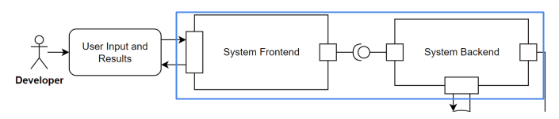
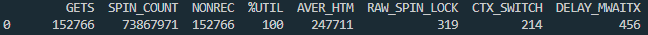
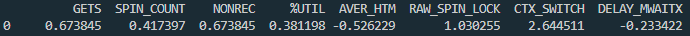
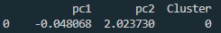
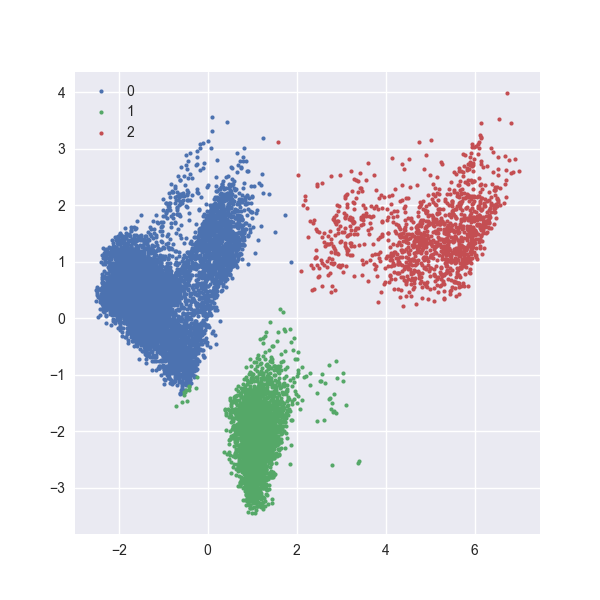
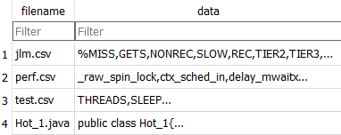

# Software Lock Contention and Fault Localization Recommender System (Prototype Build)

## Current System Architecture


### Brief Summary of Modules and their Responsibilities
#### System Frontend
- Collects input from the user using forms and menus.
- Performs preprocessing of user input and further validates it via the backend.
- Displays results to the user in a human-readable format.
- Inputs required:
  - Phase 1:
    - File Upload:
      - '.jar' file (Java program).
      - 'jlm.csv' (jlm metrics).
      - 'perf.csv' (perf metrics).
      - 'test.csv' (test metrics).
    - Text Field Input:
      - Java program arguments (used for the '.jar' file).
      - Localization start time (how long the application runs before stack tracing begins).
      - Localization run time (how long the stack tracing is performed for).
  - Phase 2:
    - File Upload:
      - '.java' file(s) (Java source files used for static analysis).
- Built in ReactJS.
#### System Backend
- Performs all logic-based functions.
- Handles processing input after it has passed through the system frontend.
- Responsible for handling middleware communication between even coordination and the system frontend.
- Initiates some events prior to the event coordinator handling the primary bulk of the orchestration.
- Built in Flask.
#### Event Coordinator
- Facilitates the communication middleware used throughout the system.
- Executes functionalities of other system modules via the Topic-based Pub/Sub Broker.
- Responsible for the orhcestration of system events throughout the end-to-end process.
- Built in Python.
#### Topic-based Pub/Sub Broker
- A publish-subscribe broker used for invoking the functionalities of other system modules.
- Used to have system exhibit an event-driven behaviour.
- Responsible for calling on module functionality when initiated by the Event Coordinator.
- Sends completion signals back to the Event Coordinator upon a module completing its designated functionality.
- Pub/sub model is in place to ensure each module is more discrete and separated from the rest of the system as development is occurring within the functionalities of various modules at any given moment (high cohesion, low coupling).
- Allows different system components to be able to run indpeendently while having them communicate via this middleware.
- Based in Apache Kafka.
#### lcClassifier
- Lock contention classifier.
- Classifies the Java program as one of three lock contention types based on already collected runtime data.
- Uses all the runtime performance metrics collected from the Java program and runs it against a pre-trained machine learning classifier.
- Classification returns 1 of 3 possible lock contention types:
  - Type 0: Minimal or no lock contention exhibited.
  - Type 1: A thread(s) is holding the lock to a critical section for a prolonged time.
  - Type 2: High frequency of access requests from threads to acquire a particular lock.
- Built in Python.
#### crLocator
- Contented region locator.
- Leverages JLM and RTdriver to collect runtime stack traces of the Java program.
- Produces and automatically parses a log file containing the resultant call stack traces.
- Localizes regions of high contention in the code.
- Built in Python, Java, and Bash.
#### apIdentifier
- Anti-pattern identifier.
- Performs static anlysis on select inputted Java source files.
- Identifies predefined anti-patterns (common bad practices) in the Java code which cause contention.
- Returns the synchronized regions found within the source code.
- Built in Java and Python.
#### Common Data Store
- A file server stored locally in the system.
- Maintains any necessary files and data used throughout the end-to-end process.
- Provides endpoints to other system modules for data retrieval and storage.
- Built in Flask.

## Video Demo of Tool
https://github.com/airwick989/IBM-Fault-Localization-Work/assets/73313597/a953761a-6915-4221-a1ca-e4a973813dfa

The Dacapo lusearch benchmark was used for the above example.

## System Components in Detail

### Main System Component
It is the main component facilitating the system. It consists of the system frontend and system backend. It is separated from the other system modules, a characteristic common throughout this tool. The main system component is comprised of the following modules:

#### Tools & Technologies Used
- React (JS)
  - Currently runs on port 3000 of the localhost (http://localhost:3000)
  - Acts as the frontend of the coordinator module.
- Flask (Python)
  - Currently runs on port 5000 of the localhost (http://localhost:5000)
  - Is the backend of the coordinator module.
#### Frontend Details
- Main routing and app structure exists in [App.js](./Initial_Build/Main/client/src/App.js).
- Main landing page is in [Home.js](./Initial_Build/Main/client/src/Home.js).
- 'Home.js' primarily utilizes and displays the [FileUploader component](./Initial_Build/Main/client/src/components/FileUploader/index.js).
- The FileUploader component  is responsible for displaying information, receiving user input, preliminary error-checking, and notifying the user of certain events.
- After ensuring the uploaded files meet some specified criteria, it uploads the files to the correct endpoint in coordinator's backend (http://localhost:5000/upload) using an HTTP POST method.
- It has error messages which may be returned to the user if the backend returns some error type.
- Once the preliminary inputs are saved for classification and localization, the [Loading component](./Initial_Build/Main/client/src/components/Loading/Loading.js) waits for a completion signal from an endpoint on the system backend, which is listening for a message indiciating that localization is completed. Once this is done, the Loading component redirects to the localizationResults endpoint (http://localhost:3000/localizationResults).
- The localizationResults endpoint consists of the [LocalizationResults component](./Initial_Build/Main/client/src/components/LocalizationResults/LocalizationResults.js) and the [PatternMatcherUploader component](./Initial_Build/Main/client/src/components/PatternMatcherUploader/PatternMatcherUploader.js).
- The LocalizationResults component displays all intermediary results of the system until localization has completed. Items such as the detected lock contention type, the complete stacktraces, and the methods/objects causing contention.
- The PatternMatcherUploader component provides a mechanism for the user to upload the Java source files which will be examined using static analysis. This component also contains some preliminary error checking.
- Once the Java source files are uploaded and the pattern-matching is completed, the frontend redirects to the endResults endpoint (http://localhost:3000/endResults), which consists of the aforementioned LocalizationResults component (so the results are still visible to the user) as well as the [EndResults component](./Initial_Build/Main/client/src/components/EndResults/EndResults.js).
- The EndResults component is used for displaying the pattern-matching results. Items such as the files analyzed, the anti-patterns detected, detailed information about each anti-pattern, and the synchronized regions found in the code are returned to the user. This is essentially the last page the user is shown, beofre they may choose to return to the Home component.
#### Backend Details
- Backend resides on '[serverv2.py](./Initial_Build/Main/flask-server/serverv2.py)'.
- The upload endpoint (http://localhost:5000/upload) is responsible for handling submitted files.
- It performs a secondary check of the files to ensure they abide by the specified criteria.
- If all file criteria is not satisifed, a specific error message is returned back to and handled by the system's frontend.
- If all input criteria is satisfied, the files and parameters are saved to the common data store to be used later. After saving the necessary data, the coordinator backend sends a signal to the lock contention classifier module to initiate classification.
- At this stage, the loading endpoint (http://localhost:5000/loading) is utilized to display a loading screen to the user while the backend listens for a completion signal from the localization module, upon which the system frontend is redirected to the localizationResults component.
- After the source file(s) submission is completed onthe frontend side, the startPatternMatcher endpoint (http://localhost:5000/startPatternMatcher) is utilized to push the source file(s) to the common data store and initiate the execution of the pattern-matcher module. This endpoint will busy loop until the completion signal from the pattern-matcher is acquired, after which it will redirect the system frontend to the endResults component.

### Event Coordinator
It is responsible for the orchestration of events throughout the end-to-end process. It communicates using the Kakfa broker and facilitates communication between each module through this middleware.
#### Tools & Technologies Used
- Python
  - Runs on a script which is essentially listening on multiple Kafka topics.
  - Is responsible for initiating the localizer and pattern-matcher.
  - Is responsible for listening for completion signals from the classifier and localizer.
#### Coordinator Details
- The event coordinator makes communications along the following Kafka topics:
  - classifierBackToCoordinator (consumer, listens for classifier completed signal)
  - coordinatorToLocalizer (producer, initiates localizer)
  - localizerBackToCoordinator (consumer, listens for localizer completed signal)
  - coordinatorToPatternMatcher (producer, initiates pattern-matcher)
 
### Topic-based Pub/Sub Broker
It is the middleware which collects and distributes the messages throughout the publish-subscribe architecture on a topic-by-topic basis.
#### Tools & Technologies Used
- Apache Kafka
  - Currently the Kafka broker is stored locally on the development machine, but the modules communicating with the broker can be set up to utilize another broker, given it has the correct topics.
  - The plan in the future is to have a cloud-based broker which hosts kafka such that it is available not only on a system's localhost.
  - Accessed by all Python-based modules using kafka-python.
#### Broker Details (Currently locally stored on a <ins>Linux</ins> machine in the development stage)
- Useful Tutorials:
  - https://youtu.be/tFlYoEJsT2k
  - https://youtu.be/LjjPjT6R9Bg
- Runs on port 9092 of the localhost by default (http://localhost:9092)
- Useful Commands (In the Kafka directory \[ex. /home/rtemsoft/kafka]):
	- Start zookeeper server (separate terminal):
	```
	./bin/zookeeper-server-start.sh ./config/zookeeper.properties
	```
	- Start Kafka server (separate terminal):
	```
	./bin/kafka-server-start.sh ./config/server.properties
	```
	- Create topic (separate terminal - with zookeeper and Kafka servers running)
	```
	./bin/kafka-topics.sh --create --bootstrap-server localhost:9092 --replication-factor 1 --partitions 1 --topic [enter topic name]
	```
	- Use a console producer (separate terminal - with zookeeper and Kafka servers running)
	```
	./bin/kafka-console-producer.sh --broker-list localhost:9092 --topic [enter topic name]
	```
	- Use a console consumer (separate terminal - with zookeeper and Kafka servers running)
	```
	./bin/kafka-console-consumer.sh --bootstrap-server localhost:9092 --topic [enter topic name]
	```
- Topics Used (thus far):
	- coordinatorToClassifier
	- classifierBackToCoordinator
	- coordinatorToLocalizer
        - localizerBackToCoordinator
        - coordinatorToPatternMatcher
        - patternMatcherBackToCoordinator
        - middlewareNotifier
  
### Lock Contention Classifier
#### Tools & Technologies Used
- Python
  - Does not run on any port.
  - Busy loops, listens for the signal on the coordinatorToClassifier topic to initiate.
#### Classifier Details
- The classifier makes communications along the following pub/sub topics:
  - coordinatorToClassifier (consumer, listens for signal from system backend to initiate classification).
  - classifierBackToCoordinator (producer, sends a classification complete signal to the event coordinator).
- Retrieves uploaded runtimes metrics files from the [Uploads directory](./Initial_Build/CommonDataStore/flask-server/Uploads) in the Common Data Store.
- All pre-trained machine learning models are found in the [Models directory](./Initial_Build/lcClassifier/flask-server/Files/Models) in the lcClassifier module.
#### Classifier Functionality
- Queries the performance metrics files (jlm.csv, perf.csv, and test.csv) from the common data store and performs some cleaning and reformatting before preprocessing.
- Perform preprocessing of the performance metrics (some merging and calculations on the datasets) to generate a combined data entry.
	
- Scale the values according to a pre-trained standard scaler.
	
- Apply principle component analysis using a pre-trained pca component to reduce the dimensionality of the data for clustering.

	
- Use a pre-trained clustering algorithm to assign a cluster (lock contention class) to the principle components.
	- Clusters produced from training data (x-axis = principle component 1, y-axis = principle component 2):
	
	- Cluster mappings:
		- Cluster 0 = Type 2 Contention
		- Cluster 1 = Type 1 Contention
		- Cluster 2 = Minimal or No Contention
#### **NOTE:** If the CSV files contain more than one entry (such as multiple samples of runtime data), only the first row will be used to determine the lock contention type.


## Performance BenchMarking
### This portion of the system is currently a work-in-progress

## Common Data Store
### Tools & Technologies Used
- SQLite (SQL)
  - The [database](./Initial_Build/files.db) ('.db' file) is stored directly in the Initial_Build directory.
  - Is stored locally in the system.
  - Accessed by all Python-based modules using SQLAlchemy.
### Database Model (Columns)
- Model Structure:
  ```
  CREATE TABLE file (
	filename VARCHAR(50) NOT NULL, 
	data BLOB, 
	PRIMARY KEY (filename)
  )
  ```
- Columns:
	- filename (VARCHAR\[50\], NOT NULL, primary key)
  		- The name of an uploaded file is stored in this column as a string. It is the primary key.
	- data (BLOB)
  		- The data of an uploaded file is stored in the database as a binary object.
- Example Database State:



## Contented Region Locator
### This portion of the system is currently a work-in-progress
## Anti-pattern Identifier
### This portion of the system is currently a work-in-progress
