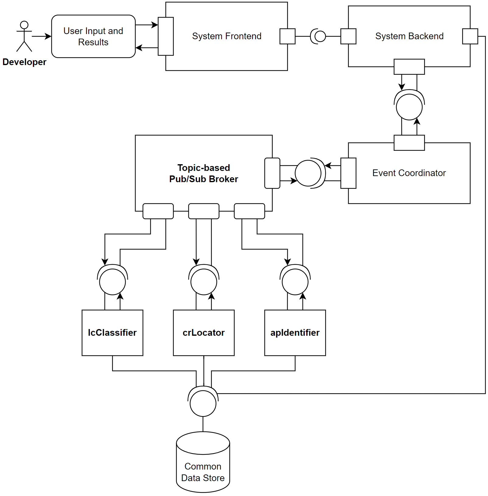

# Software Lock Contention and Fault Localization Recommender System (Prototype Build)

## Current System Architecture

### Modules and Responsibilities
#### Coordinator
- Acts as primary interface for the user to the system.
- Where the user enters the necessary inputs to the system.
- Types of inputs accepted:
  - '.java' file (Java program) (must be uploaded).
  - 'jlm.csv' (jlm metrics) (optional).
  - 'perf.csv' (perf metrics) (optional).
  - 'test.csv' (test metrics) (optional).
#### Performance Benchmarking
- Responsible for executing a performance benchmarking of the uploaded Java program.
- Records, collects, and stores performance metrics.
- Currently a black box in the system (area of investigation).
#### Common Data Store
- Database stored locally in the system.
- Stores files to be shared across multiple modules.
- Stores files as binary objects to be encoded and decoded.
- Details of the 'Common Data Store' found on [Database Configuration](##database-configuration) section.
#### Topic-based Pub/Sub Broker
- Used to have system exhibit an event-driven behaviour.
- Responsible for calling on module functionality when initiated by the Coordinator.
- Sends completion signals back to the Coordinator upon a module completing its designated functionality.
- Pub/sub model is in place to ensure each module is more discrete and separated from the rest of the system as development is occurring within the functionalities of various modules at any given moment (high cohesion, low coupling).
#### lcClassifier
- Uses all the performance metrics collected from the Java program and runs it against a pre-trained machine learning classifier.
- Classification returns 1 of 3 possible lock contention types:
  - Type 0: Minimal or no lock contention exhibited.
  - Type 1: A thread(s) is holding the lock to a critical section for a prolonged time.
  - Type 2: High frequency of access requests from threads to acquire a particular lock.

## Database Configuration
